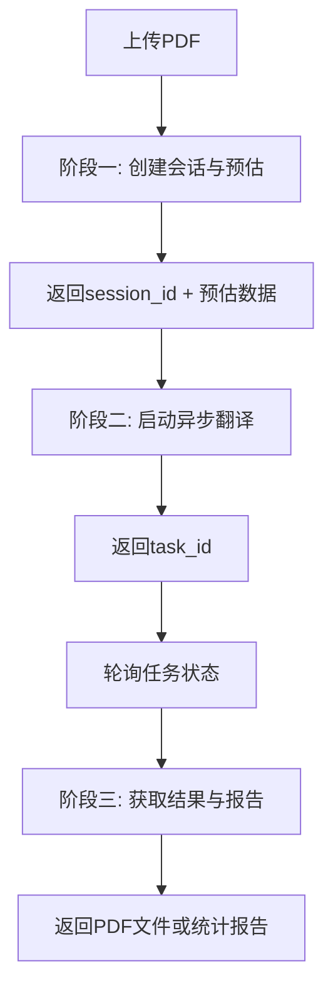

# PDF2ZH V2 API 文档

## 🎯 概述

PDF2ZH V2 API 采用全新的**三阶段、状态化翻译管线**架构，彻底解耦了分析、翻译和报告生成三个核心环节。这种设计将数据（而非文件）作为流程的核心驱动力，提供了极致的用户体验和系统可维护性。

## 🏗️ 架构设计

### 核心理念

- **极致解耦**：三个阶段完全独立，可单独开发、测试和优化
- **状态管理**：通过服务端会话管理复杂的上下文传递
- **数据驱动**：以结构化JSON数据为核心，而非文件传递
- **异步优先**：所有耗时操作都支持异步处理
- **用户友好**：快速预估、按需翻译、灵活获取结果

### 三阶段流程



## 📊 数据流架构

### 分层抽象

```
┌─────────────────────────────────────────────┐
│             Client Layer                    │
│  (example_v2_usage.py - 客户端示例)         │
└─────────────────────┬───────────────────────┘
                      │
┌─────────────────────▼───────────────────────┐
│         API Service Layer                   │
│     (backend.py - 接口服务层)               │
│  • 会话管理 (SessionManager)                │
│  • API端点路由                              │
│  • Redis状态存储                            │
│  • Celery任务调度                           │
└─────────────────────┬───────────────────────┘
                      │
┌─────────────────────▼───────────────────────┐
│        Business Logic Layer                 │
│    (high_level.py - 业务逻辑层)             │
│  • start_analysis_task()                    │
│  • execute_translation_only()               │
│  • finalize_statistics_data()               │
└─────────────────────┬───────────────────────┘
                      │
┌─────────────────────▼───────────────────────┐
│         Core Engine Layer                   │
│   (converter.py - 核心引擎层)               │
│  • AnalysisConverter                        │
│  • TranslateConverter                       │
│  • 并发表格翻译器                           │
└─────────────────────────────────────────────┘
```

## 🔧 API 端点详解

### V2 API (新架构)

#### 1. 阶段一：创建会话与预估分析

**POST** `/v2/session/create`

**功能**：上传PDF文件，执行快速内容分析，返回预估数据和会话ID。

**请求格式**：
```http
Content-Type: multipart/form-data

file: [PDF文件]
params: {
  "service": "google",
  "reasoning": false,
  "pages": null
}
```

**响应示例**：
```json
{
  "session_id": "uuid-string",
  "estimation": {
    "estimated_paragraphs": 45,
    "estimated_table_cells": 12,
    "total_estimated_tokens": 1580,
    "estimated_translation_time_seconds": 158,
    "service": "google",
    "pages_analyzed": 8
  },
  "file_info": {
    "size_bytes": 245760
  },
  "created_at": "2024-01-15T10:30:00Z",
  "analysis_duration_seconds": 2.35
}
```

#### 2. 阶段二：启动异步翻译任务

**POST** `/v2/session/{session_id}/translate`

**功能**：基于会话ID启动异步翻译任务。

**请求格式**：
```json
{
  "lang_in": "en",
  "lang_out": "zh",
  "service": "google",
  "thread": 4,
  "use_concurrent_table_translation": true
}
```

**响应示例**：
```json
{
  "task_id": "celery-task-id",
  "session_id": "uuid-string",
  "status": "started"
}
```

#### 3. 任务状态查询

**GET** `/v2/task/{task_id}/status`

**响应示例**：
```json
{
  "task_id": "celery-task-id",
  "state": "PROGRESS",
  "info": {
    "current": 3,
    "total": 8,
    "status": "翻译进度 3/8 页"
  }
}
```

#### 4. 阶段三：获取结果与报告

**GET** `/v2/task/{task_id}/result/{artifact}`

**支持的artifact类型**：
- `report_data`: JSON格式的最终统计报告
- `mono_pdf`: 单语PDF文件
- `dual_pdf`: 双语PDF文件

**统计报告示例**：
```json
{
  "session_info": {
    "session_id": "uuid-string",
    "created_at": "2024-01-15T10:30:00Z",
    "file_size_bytes": 245760,
    "pages_processed": 8
  },
  "estimation_summary": {
    "estimated_paragraphs": 45,
    "estimated_table_cells": 12,
    "estimated_tokens": 1580,
    "estimated_time_seconds": 158
  },
  "runtime_summary": {
    "actual_tokens": {
      "total": 1623,
      "prompt_tokens": 1200,
      "completion_tokens": 423,
      "translation_calls": 57
    },
    "paragraphs": {
      "total": 45,
      "translated": 42,
      "skipped_empty": 2,
      "skipped_formula": 1
    },
    "table_cells": {
      "total": 12,
      "translated": 10,
      "skipped_empty": 2
    },
    "actual_time_seconds": 145.7
  },
  "comparison": {
    "token_accuracy": {
      "estimated": 1580,
      "actual": 1623,
      "diff_percent": 2.7,
      "accuracy_level": "high"
    },
    "time_accuracy": {
      "estimated_seconds": 158,
      "actual_seconds": 145.7,
      "diff_seconds": -12.3,
      "accuracy_level": "high"
    }
  },
  "performance_metrics": {
    "analysis_duration_seconds": 2.35,
    "translation_duration_seconds": 145.7,
    "tokens_per_second": 11.14,
    "paragraphs_per_second": 0.29
  },
  "quality_indicators": {
    "translation_coverage": {
      "paragraph_coverage_percent": 93.3,
      "table_coverage_percent": 83.3
    },
    "efficiency_score": 89.5
  }
}
```

### V1 API (兼容性保持)

原有的V1 API端点保持完全兼容，确保现有客户端的正常运行：
- `POST /v1/translate`
- `GET /v1/translate/{id}`
- `DELETE /v1/translate/{id}`
- `GET /v1/translate/{id}/{format}`

## 💾 会话管理

### Redis存储结构

```
# PDF字节流存储
pdf:{session_id} -> PDF bytes (TTL: 24小时)

# 统计对象存储  
stats:{session_id} -> PDFTranslationStatistics (TTL: 24小时)

# 任务-会话映射
task_to_session:{task_id} -> session_id (TTL: 48小时)
```

### 生命周期管理

- **会话创建**：阶段一创建后存储24小时
- **自动清理**：Redis TTL机制自动处理过期数据
- **手动清理**：提供管理接口 `POST /v2/sessions/cleanup`

## 🚀 核心优势

### 1. 用户体验优势

- **快速预估**：5秒内获得翻译成本和时间预估
- **按需翻译**：用户可基于预估决定是否继续
- **实时进度**：支持翻译进度的实时追踪
- **灵活获取**：可分别获取文件和报告，支持多种格式

### 2. 技术架构优势

- **高度解耦**：三个阶段可独立扩展和优化
- **状态清晰**：服务端会话管理避免复杂的上下文传递
- **数据驱动**：JSON数据流便于集成和后续扩展
- **容错性强**：每个阶段都有完善的错误处理

### 3. 开发维护优势

- **职责单一**：每个函数和API的职责极其明确
- **易于测试**：各层级可独立进行单元测试
- **便于监控**：详细的性能指标和质量指标
- **支持扩展**：为数据看板、成本分析等功能奠定基础

## 🛠️ 部署配置

### 环境要求

```bash
# Redis (用于会话管理)
REDIS_URL=redis://127.0.0.1:6379/1

# Celery (用于异步任务)
CELERY_BROKER=redis://127.0.0.1:6379/0
CELERY_RESULT=redis://127.0.0.1:6379/0

# 布局分析模型
NOTO_FONT_PATH=/app/fonts/
```

### 启动服务

```bash
# 启动Redis
redis-server

# 启动Celery Worker
celery -A pdf2zh.backend worker --loglevel=info

# 启动Flask API服务
python pdf2zh/backend.py
```

## 📝 使用示例

详细的使用示例请参考 `example_v2_usage.py` 文件，其中包含：

- 完整的三阶段调用流程
- 错误处理和重试逻辑
- 进度监控和状态查询
- 结果获取和文件下载

### 快速开始

```python
from example_v2_usage import PDF2ZHV2Client

# 初始化客户端
client = PDF2ZHV2Client("http://localhost:5000")

# 阶段一：创建会话
session = client.create_session("document.pdf")

# 阶段二：启动翻译
task = client.start_translation(session['session_id'], {
    "lang_out": "zh",
    "service": "google"
})

# 阶段三：获取结果
if client.wait_for_translation(task['task_id']):
    report = client.get_translation_report(task['task_id'])
    pdf_path = client.download_pdf(task['task_id'], "dual")
```

## 🔍 健康检查

**GET** `/health`

检查系统各组件的健康状态：

```json
{
  "status": "healthy",
  "timestamp": "2024-01-15T10:30:00Z",
  "services": {
    "redis": "connected",
    "celery": "connected"
  }
}
```

## 📚 进一步扩展

基于这个三阶段架构，可以轻松扩展以下功能：

1. **成本分析面板**：基于统计数据构建成本可视化
2. **性能监控系统**：利用性能指标进行系统优化
3. **批量处理接口**：支持多文件的批量翻译
4. **用户管理系统**：基于会话实现用户权限控制
5. **翻译质量评估**：基于质量指标提供翻译建议

---

**注意**：V2 API与V1 API完全兼容，现有客户端可以无缝迁移。建议新项目直接使用V2 API以获得更好的用户体验和功能扩展性。 